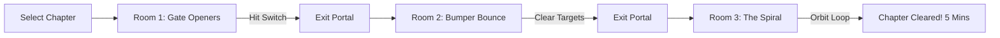

# Game Design Document: Flipoff (Snap Edition)
## A Minimalist, Room-Based Pinball Puzzle Game for Micro-Sessions

---

## 1. High-Level Concept & Pitch

**Flipoff: Snap** is a minimalist, zen-like pinball puzzle game designed for portrait-mode, single-thumb play. Instead of simulating a loud, chaotic, multi-ball arcade machine, it breaks pinball down into discrete, beautifully designed **micro-tables (rooms)**. Each room is a bite-sized physics puzzle that can be cleared in under 60 seconds.

### The Pitch
> *“Snackable pinball. Clean geometry, soothing ambient music, and tactical puzzles you can solve one-handed on your commute, in a waiting room, or during a quick break.”*

### Core Pillars
1. **Snackable Session Design (5–10 Mins):** The game is structured around "Chapters" of 5–7 rooms. Clearing a chapter takes exactly 5 minutes. The game saves state after every single shot, allowing instant exit and resume without penalty.
2. **Asymmetrical Layout (One-Thumb Control):** The bottom of the table features a single, double-wide flipper pivoted on one side, replacing the traditional twin-flipper system.
3. **Zen Aesthetics:** Premium glassmorphic boards, glowing neon rails, soft particle tracks, and ambient acoustic soundscapes.

---

## 2. Ergonomics & The Asymmetrical Single-Flipper Layout

Traditional twin flippers require independent left/right trigger inputs, which is physically difficult during one-handed mobile play. To solve this, *Flipoff: Snap* features a **Single-Flipper Asymmetrical Layout**.

### Layout Mechanics:
* **The Flipper:** A single glassmorphic lever that is double the width of a standard flipper, pivoted on the bottom-left corner of the playfield and extending roughly 80–85% across the screen.
* **The Gutter:** The remaining 15–20% on the bottom-right corner represents the open drain (gutter). 
* **The Slope:** In its inactive resting state, the flipper rests at a downward angle, forming a ramp that points directly down into the gutter. 
* **The Action:** Tapping anywhere on the screen rotates the flipper upward (clockwise around its left pivot).
* **The Gameplay Loop:** 
    1. Gravity draws the ball downward.
    2. When the ball lands on the flipper, it rolls down the slope toward the bottom-right gutter.
    3. The player must time their tap (flip) to launch the ball back into the playfield. Flipping too early launches the ball straight up; flipping too late drains the ball into the gutter.
    4. This converts the traditional two-button reflex challenge into a single-button rhythm/timing mechanic, making it extremely comfortable for single-thumb play.

---

## 3. Micro-Session Loop: Room-Based Architecture

Traditional pinball tables are large, vertical, and open-ended. *Flipoff: Snap* divides the game into discrete, puzzle-like chambers.

### Room Rules:
* **Objective-Driven:** Each room has a simple, clear objective:
    * *Target Mode:* Destroy all glowing crystals/drop targets.
    * *Key Mode:* Hit a specific switch to open the exit gate.
    * *Portal Mode:* Navigate the ball through a shifting loop into a sinkhole.
* **Limited Shots (Puzzle Aspect):** The player has a set number of launches (e.g., 5 shots) to clear the room. Draining the ball or running out of shots simply resets the current room, rather than restarting the entire game.
* **State Retention:** If the player closes the app mid-room, the game auto-saves the ball's exact position, current room objectives, and remaining shots, loading back instantly on relaunch.

---

## 4. Visual & Auditory Aesthetics: Zen Minimalist

To create a premium feel that fits a 5-minute mental break, the visual and sound design are clean and satisfying.

* **Visual Style (Neon Glassmorphic):** Dark mode by default. Board borders are thin, glowing neon paths. Bumpers are transparent glass circles that pulse with soft light when hit. The ball is a polished chrome marble that leaves a faint, fading light trail.
* **Audio Design (Acoustic & Tactile):**
    * Ditching the loud solenoids for organic sounds: flipper snaps sound like a dry wooden click; bumper hits trigger soft glass xylophone notes or wind-chime chords.
    * Ambient background music consists of slow, rhythmic synth pads that shift keys depending on the ball's velocity.
* **Haptics:** Short, crisp, microscopic vibrations (`HapticFeedback.selectionClick()`) when hitting targets, giving a tactile sense of depth without draining the phone's battery.

---

## 5. Flame Engine Implementation Specifications

### A. Level Progression State Management
* Build a room manager class (`RoomManager`) extending `Component`.
* Each room is loaded from a JSON layout structure defining static wall boundaries, bumper locations, and target coordinates.
* Use `world.removeAll()` and load the new room component structure when the ball enters the Exit Portal, ensuring transition times are sub-100ms.

### B. Single Flipper Joint Tuning (Forge2D)
* Represent the double-wide flipper as a single Box2D body.
* Attach it to the lower-left static playfield border using a `RevoluteJoint`.
* Set the joint limits to allow an upward sweep angle (e.g., -15 degrees to +25 degrees relative to horizontal).
* On user tap, apply an instantaneous upward torque. On release, apply a spring-back torque to return it to the resting sloped state.

### C. Gutter Sensor
* Place a Box2D sensor body in the bottom-right opening.
* When the ball enters this sensor, trigger the "Drain" sequence (particle dissolution and room reset).
