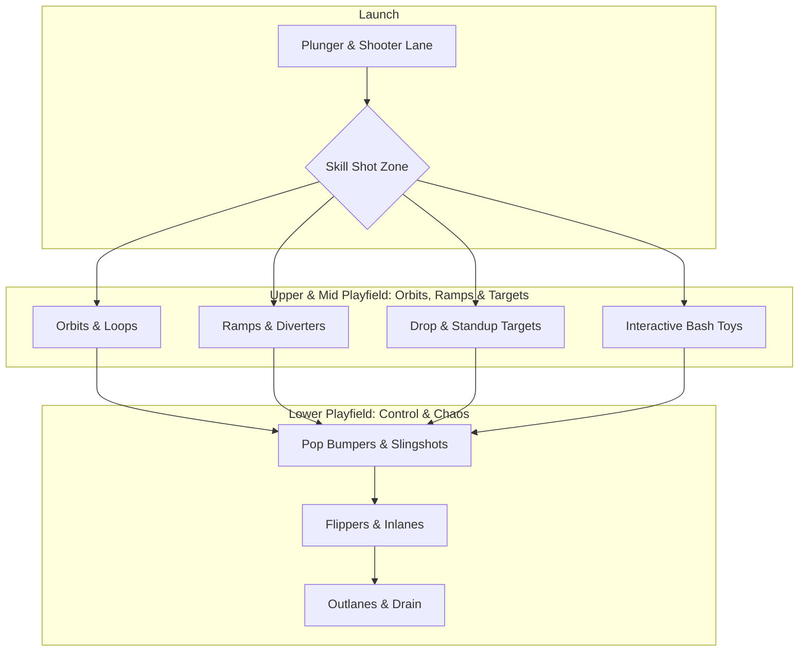
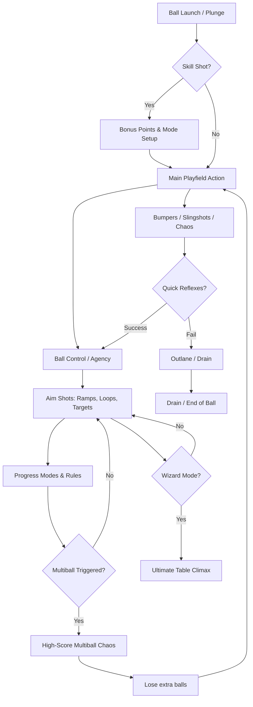

# Pinball Design Knowledge Base: Physical & Digital Mechanics

Pinball is a unique synthesis of kinetic physics, mechanical engineering, rule-based game design, and multi-sensory orchestration. From its electromechanical origins in the mid-20th century to modern digital simulations and fantasy pinball games, understanding pinball means understanding the balance between **kinetic chaos** and **player agency**.

This knowledge base serves as a design guide for understanding what makes pinball enjoyable and provides recommendations for building a digital pinball game.

---

## 1. Anatomy of a Pinball Table

A successful pinball table is structured around key zones that balance ball control, speed, hazard mitigation, and goal progression.

### Core Playfield Components

| Component | Category | Mechanical Behavior & Player Impact |
| :--- | :--- | :--- |
| **Flippers** | Agency | The player's primary point of interaction. Standard physical flippers are 3 inches long. Their spacing, alignment, and solenoid strength dictate the game's overall precision and control. |
| **Ramps** | Flow | Gravity-defying lanes that redirect the ball to the upper sections or back to the opposite flipper. Successful ramp shots feed the "flow" state by maintaining ball momentum. |
| **Orbits / Loops** | Flow | Smooth, circular pathways around the outer edge of the playfield. They allow the ball to maintain high velocity and return to the flippers quickly. |
| **Pop Bumpers** | Chaos | Solenoid-activated circular assemblies that rapidly kick the ball away in random directions when touched. They inject unpredictability into the gameplay loop. |
| **Slingshots** | Chaos | Triangular, rubber-wrapped kicks directly above the flippers. They bounce the ball side-to-side, posing a major threat of pushing the ball into the outlanes. |
| **Drop Targets** | Progression | Physical cards that retract into the playfield when hit. Dropping a full bank often triggers modes, unlocks multiball, or increases multipliers. |
| **Bash Toys** | Spectacle | Interactive, theme-specific objects (e.g., a swinging castle gate, a moving monster, or a spinning disc) that provide immediate kinetic and visual feedback when struck repeatedly. |
| **Inlanes & Outlanes** | Risk / Reward | Inlanes feed the ball safely to the flippers (often lighting up scoring lanes). Outlanes are death zones that lead to ball drains, requiring active nudging to escape. |

---

## 2. The Core Gameplay Loop: Control vs. Chaos

At its heart, pinball is a continuous negotiation between **kinetic unpredictability (chaos)** and **precise player techniques (control)**. 

### Ball Control Techniques (Skill Ceiling)
A pinball game is only as satisfying as its physical skill ceiling. Skilled players do not simply "flip at everything"; they use physics to bring the ball under control:
*   **Cradling (Catching):** Holding a flipper up to catch the incoming ball and bring it to a complete rest. This allows the player to aim their next shot precisely.
*   **Dead Flipping:** Allowing a fast-moving ball to bounce off a stationary, un-flipped flipper. The rubber absorbs the impact, bouncing the ball gently to the opposite flipper for better control.
*   **Post-Passing:** Flicking the flipper quickly to bounce the ball from the tip of one flipper to the base of the opposite flipper.
*   **Nudging (Shaking the Cabinet):** Physically shifting the machine to alter the ball's trajectory, particularly when it is bouncing near the hazardous outlanes. If a player nudges too aggressively, the machine's internal pendulum hits a metal ring, triggering a **Tilt** which shuts down the flippers and forfeits the current ball's bonuses.

### Rulesets & Progression (The Software Layer)
While casual players enjoy hitting random targets, seasoned players engage with the rules:
*   **Modes & Missions:** Temporary game states activated by hitting specific targets. The player must complete a series of shots within a time limit (e.g., "hit 3 ramps to defeat the monster").
*   **Multiball:** The peak of excitement. Launching 2 to 6 balls simultaneously onto the playfield. This escalates the chaos while scaling the scoring potential through "Jackpots."
*   **Stacking:** A high-level strategy where a player starts a mode, initiates a multiball, and activates scoring multipliers simultaneously to achieve massive score returns.
*   **Wizard Mode:** The ultimate finale of the ruleset, unlocked only after completing all modes on the table. It is designed to be highly difficult and cinematic.

---

## 3. Physical vs. Virtual Pinball: A Comparative Analysis

Virtual pinball has evolved from basic 2D screen-scrolling games into a mature medium comprising hyper-realistic 3D simulators and physical-digital hybrid cabinets.

### Key Dimensions Comparison

| Dimension | Physical Pinball | Virtual Pinball (Emulators / Engines) | Fantasy Video Game Pinball |
| :--- | :--- | :--- | :--- |
| **Physics** | Real-world gravity, material friction, bounce coefficients, and environmental wear. | Simulated gravity, collision boxes, and rigid-body mathematical formulas. | Stylized, custom-tailored physics. Can incorporate anti-gravity, air-steering, or thrusters. |
| **Tactility** | Real mechanical feedback: solenoids thumping, cabinet vibrations, button resistance. | Simulated via haptic transducers, shaker motors, and nudge sensors (Pincabs). | Rely on standard gamepad vibrations (rumble) and sound effects. |
| **Scope & Variety** | One physical table. Swapping layouts requires buying or maintaining a new machine ($5K–$12K+). | Can host thousands of simulated or original tables on a single digital cabinet. | Unique levels, bosses, scrolling screens, and multi-tier stages in a single purchase. |
| **Maintenance** | High. Mechanical parts wear down, bulbs burn out, and playfields need regular cleaning. | None. Occasional software configuration or driver updates. | None. Pure software execution. |
| **Visual Design** | Physical light inserts, mechanical toy assemblies, backglass art, DMD/LCD displays. | High-fidelity screen renders, simulated lighting reflections, and digital LCD/DMDs. | Dynamic particle effects, moving sprites, animated backgrounds, and narrative cutscenes. |
| **Constraints** | Bound by gravity, physical cost, safety, and mechanical reliability. | Attempting to replicate physical constraints perfectly is computationally difficult. | Completely free of physical constraints. Can bend physics, spawn elements, and change layouts. |

---

## 4. Fantasy Video Game Pinball: Breaking the Physical Rules

Fantasy pinball games (e.g., *Devil's Crush*, *Sonic Spinball*, *Metroid Prime Pinball*, *Yoku's Island Express*) represent a creative branch that treats the pinball table not as a mechanical cabinet, but as a living platformer or action level.

### Key Innovations of Fantasy Pinball

1.  **The "Living" Playfield:**
    *   **Enemies & Bosses:** Moving characters walk across the playfield, acting as interactive blockers or targets. Hitting them inflicts damage, drops items, or unlocks new zones.
    *   **State-Changing Geometry:** Ramps that dissolve, walls that crumble, or pathways that morph dynamically based on game progress rather than relying on mechanical trapdoors.
2.  **Physics-Defying Mechanics:**
    *   **Air Control:** Allowing the player to nudge or steer the ball slightly while it is mid-air (e.g., using Sonic's spin dash or Metroid's morph ball thrusters).
    *   **Portals & Teleportation:** Dropping the ball into a hole doesn't just lock it; it can teleport it to entirely different screens, dimensional sub-tables, or bonus mini-games.
3.  **Hybrid Genres:**
    *   **Adventure/RPG Integration:** Earning gold, purchasing upgrades (stronger flippers, magnetic shields), leveling up stats, or using special weapons that can be fired from the flippers.
    *   **Metroidvania Progression:** In *Yoku's Island Express*, the flippers are scattered across a massive, open-world platforming map, turning the pinball ball into an explorer navigating paths and collecting power-ups.

---

## 5. Psychology of Enjoyment: What Makes Pinball Fun?

The timeless appeal of pinball relies on specific psychological triggers that hook players:

*   **The Illusion of Control:** The ball moves fast and is heavily affected by chaotic forces (bumpers, slingshots). However, because the flippers provide instant, low-latency agency, the player feels *responsible* for every success and failure. This balance between skill and chance is highly addictive.
*   **Kinetic and Audio Feedback (Juice):** The physical weight and velocity of a 27g steel ball bouncing off rubber and metal generates immediate visual and auditory satisfaction. In digital games, this must be simulated using high-quality sound synthesis, screen shakes, and particle sparks.
*   **Dynamic Visual Hierarchy:** A player's eyes must be drawn to the next high-value target. Pinball machines do this via "flashing inserts" (arrows on the playfield pointing to active ramps). Successful games guide the player's focus through lighting and sound cues rather than chaotic screen clutter.
*   **Unpredictability & Variance:** Unlike static puzzle games, no two games of pinball are identical. Microscopic variations in flipper release times, rubber elasticity, or tilt angle spin the ball off in entirely unique trajectories, preventing repetitive gameplay patterns.

---

## 6. Recommendations for "Flipoff" (Flame Engine Game)

To build a highly engaging and mechanically sound digital pinball game in Flutter using the **Flame Engine**, the following design practices should be implemented:

### A. Physics & Collisions (FCS Implementation)
*   **Forge2D Integration:** Use `flame_forge2d` (Flame's wrapper around Box2D) for robust, stable rigid-body physics. Trying to write custom vector elastic collisions for circular balls against curved flippers and ramps in pure Flame will quickly lead to clipping bugs.
*   **Flipper Solenoid Simulation:** In Forge2D, represent flippers as dynamic bodies connected to the table structure using a `RevoluteJoint`. When the user taps the screen, apply a high, instantaneous torque to rotate the flipper up to its limit stop. When released, apply a return spring torque to quickly snap it back down.
*   **Collision Filtering:** Use Box2D's collision categories. Ensure that the ball only collides with the playfield borders, flippers, and bumpers, avoiding unnecessary overlap checks with trigger areas (like scoring zones or lane sensors).

### B. Input Latency Mitigation
*   **Raw Tap Events:** Use `TapCallbacks` on a full-screen input overlay or handle keyboard presses directly via `KeyboardEvents` on the game class. Flippers must feel highly responsive; even a 50ms input delay will ruin the player's ability to cradle or aim shots.
*   **Haptic Triggering:** On mobile platforms, trigger short, sharp haptic taps (`HapticFeedback.lightImpact()`) exactly when the ball collides with pop bumpers or slingshots, and a medium impact when the flipper hits its rotation limit.

### C. Visual Layout & Camera handling
*   **Vertical Playfield Aspect Ratio:** Pinball playfields are traditionally 1:2 or 9:16.
    *   For mobile screens, lock the orientation to portrait.
    *   For desktop/web builds, set up the `CameraComponent`'s viewport to center a vertical playfield on the screen, using the side margins for HUD elements (Score, Multipliers, Active Mode, Ball Count).
*   **Smooth Camera Tracking:** If using a high-detail zoomed-in view, configure the camera to smoothly follow the ball's Y-coordinate with a slight dampening factor, ensuring the flippers remain visible at the bottom of the screen.

### D. Adding Digital-Native "Juice"
Since `flipoff` is a digital game, it shouldn't just copy physical limits:
*   **Dynamic Bumpers:** Make pop bumpers pulse in scale and glow brighter when hit, emitting particle rings that fade out.
*   **Score Popups:** Spawn floating text components at the collision point (e.g., "+500") that float upwards and fade out.
*   **Slow-Motion Moments:** Implement a brief slowdown effect (time dilation) when the ball is inches away from draining, giving the player a split-second window to nudge the cabinet or execute a clutch save.
